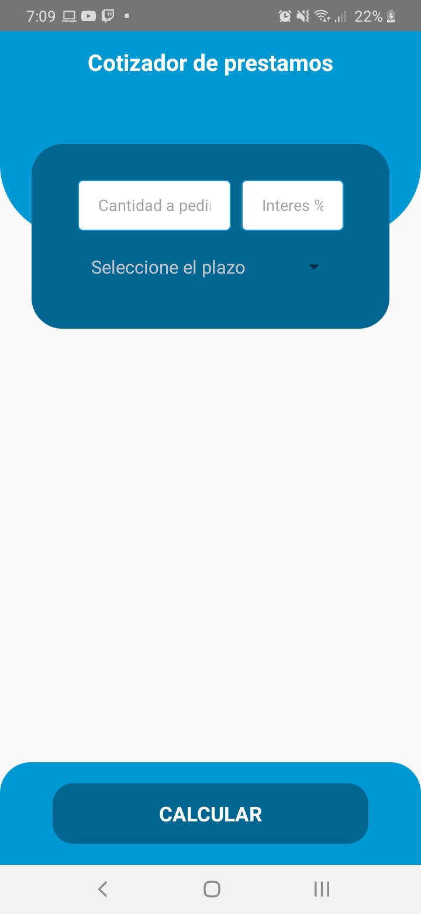

# cotizador-prestamos

-Project Description

This repository contains a project developed in React Native, it is an application to calculate loans based on the capital requested, the interest rate and the duration of the loan in months.

-Demo

-Screenshots

